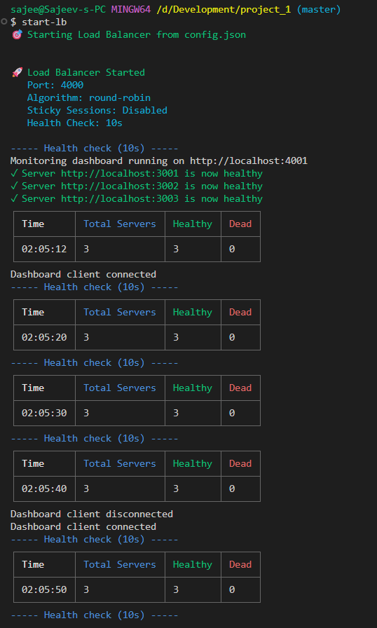
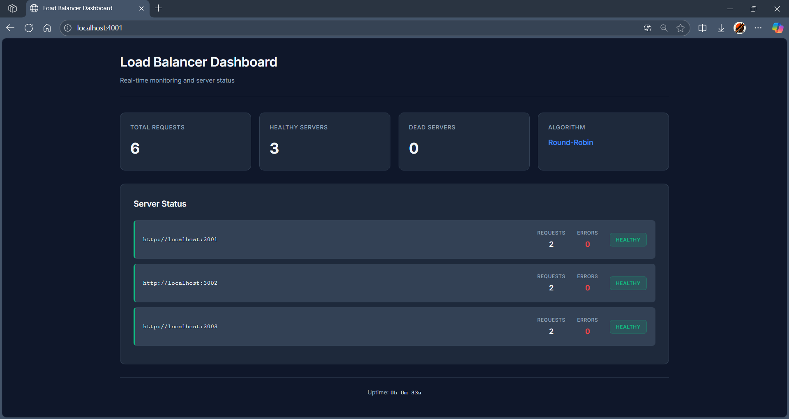
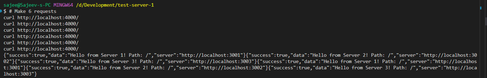

# Advanced Node.js Load Balancer

[](https://nodejs.org/)
[](https://opensource.org/licenses/MIT)
[](http://makeapullrequest.com)
[](https://github.com/yourusername/advanced-nodejs-load-balancer/graphs/commit-activity)

A production-grade HTTP load balancer built with Node.js featuring multiple balancing algorithms, sticky sessions, path-based routing, and real-time monitoring dashboard.

[Features](#features) • [Demo](#demo) • [Installation](#installation) • [Usage](#usage) • [Configuration](#configuration) • [Documentation](#documentation)

---

## Table of Contents

- [Features](#features)
- [Demo](#demo)
- [Architecture](#architecture)
- [Installation](#installation)
- [Quick Start](#quick-start)
- [Configuration](#configuration)
- [Load Balancing Algorithms](#load-balancing-algorithms)
- [Advanced Features](#advanced-features)
- [API Documentation](#api-documentation)
- [Monitoring Dashboard](#monitoring-dashboard)
- [Testing](#testing)
- [Project Structure](#project-structure)
- [Tech Stack](#tech-stack)
- [Contributing](#contributing)
- [License](#license)
- [Roadmap](#roadmap)

## Features

### Core Functionality

- **Multiple Load Balancing Algorithms**
  - Round Robin
  - Weighted Round Robin
  - Least Connections
  - Weighted Least Connections

- **Health Checking**
  - Automatic server health monitoring
  - Configurable check intervals
  - Automatic failover and recovery

- **Sticky Sessions**
  - Session persistence via cookies
  - Consistent user routing
  - Automatic session cleanup

- **Path-Based Routing**
  - Route requests based on URL patterns
  - Support for wildcard matching
  - Per-route server groups

- **Real-Time Monitoring**
  - WebSocket-based live dashboard
  - Request/error tracking per server
  - Visual server health status

- **Configuration-Driven**
  - JSON-based configuration
  - No code changes required
  - Hot-reloadable settings

## Demo

### Health Check & Auto-Recovery


### Real-Time Monitoring Dashboard


### Load Distribution in Action


## Architecture

```
┌─────────────┐
│   Client    │
└──────┬──────┘
       │
       ▼
┌──────────────────────────────────┐
│     Load Balancer (Port 4000)    │
│  ┌────────────────────────────┐  │
│  │  Algorithm Selector        │  │
│  │  - Round Robin             │  │
│  │  - Weighted RR             │  │
│  │  - Least Connections       │  │
│  └────────────────────────────┘  │
│  ┌────────────────────────────┐  │
│  │  Session Manager           │  │
│  │  (Sticky Sessions)         │  │
│  └────────────────────────────┘  │
│  ┌────────────────────────────┐  │
│  │  Route Matcher             │  │
│  │  (Path-Based Routing)      │  │
│  └────────────────────────────┘  │
│  ┌────────────────────────────┐  │
│  │  Health Monitor (Cron)     │  │
│  └────────────────────────────┘  │
└──────────┬───────────────────────┘
           │
    ┌──────┴──────┬────────────┐
    ▼             ▼            ▼
┌────────┐   ┌────────┐   ┌────────┐
│Server 1│   │Server 2│   │Server 3│
└────────┘   └────────┘   └────────┘
```

## Installation

### Prerequisites

- **Node.js** >= 18.0.0
- **npm** >= 9.0.0
- Git

### Clone the Repository

```bash
git clone https://github.com/yourusername/advanced-nodejs-load-balancer.git
cd advanced-nodejs-load-balancer
```

### Install Dependencies

```bash
npm install
```

### Link CLI Command

```bash
npm link
```

## Quick Start

### Step 1: Configure Your Servers

Edit `config.json`:

```json
{
  "port": 4000,
  "algorithm": "round-robin",
  "servers": [
    { "url": "http://localhost:3001", "weight": 1 },
    { "url": "http://localhost:3002", "weight": 2 }
  ]
}
```

### Step 2: Start Backend Servers

```bash
# Terminal 1
node test-server-1.js

# Terminal 2
node test-server-2.js
```

### Step 3: Start Load Balancer

```bash
start-lb
```

### Step 4: Test It

```bash
curl http://localhost:4000/
```

Open monitoring dashboard: `http://localhost:4001`

## Configuration

### Configuration File (`config.json`)

```json
{
  "port": 4000,
  "healthCheck": {
    "endpoint": "/health",
    "interval": 10
  },
  "algorithm": "round-robin",
  "enableStickySession": false,
  "servers": [
    {
      "url": "http://localhost:3001",
      "weight": 1
    },
    {
      "url": "http://localhost:3002",
      "weight": 2
    },
    {
      "url": "http://localhost:3003",
      "weight": 1
    }
  ],
  "routes": [
    {
      "path": "/api/*",
      "servers": [0, 1]
    },
    {
      "path": "/images/*",
      "servers": [2]
    },
    {
      "path": "/*",
      "servers": [0, 1, 2]
    }
  ]
}
```

### Configuration Options

| Option | Type | Default | Description |
|--------|------|---------|-------------|
| `port` | number | 4000 | Load balancer port |
| `algorithm` | string | "round-robin" | Load balancing algorithm |
| `enableStickySession` | boolean | false | Enable session persistence |
| `healthCheck.endpoint` | string | "/health" | Health check URL path |
| `healthCheck.interval` | number | 10 | Health check interval (seconds) |
| `servers` | array | [] | Backend server configurations |
| `servers[].url` | string | - | Server URL |
| `servers[].weight` | number | 1 | Server weight (for weighted algorithms) |
| `routes` | array | [] | Path-based routing rules |

## Load Balancing Algorithms

### Round Robin
Distributes requests evenly across all healthy servers.

```json
{
  "algorithm": "round-robin"
}
```

**Use Case:** When all servers have equal capacity.

### Weighted Round Robin
Distributes requests based on server weights.

```json
{
  "algorithm": "weighted-round-robin",
  "servers": [
    { "url": "http://localhost:3001", "weight": 1 },
    { "url": "http://localhost:3002", "weight": 3 }
  ]
}
```

**Use Case:** When servers have different capacities (Server 2 gets 3x more requests).

### Least Connections
Routes to the server with the fewest active connections.

```json
{
  "algorithm": "least-connections"
}
```

**Use Case:** When request processing times vary significantly.

### Weighted Least Connections
Combines weights and connection counts.

```json
{
  "algorithm": "weighted-least-connections"
}
```

**Use Case:** Unequal server capacities + varying request durations.

## Advanced Features

### Sticky Sessions

Enable session persistence to route users to the same server:

```json
{
  "enableStickySession": true
}
```

**How it works:**
- First request: Load balancer assigns a server and sets a cookie
- Subsequent requests: Cookie routes user to the same server
- Cookie expires after 24 hours or when server becomes unhealthy

**Testing Sticky Sessions:**

```bash
# First session
curl -c cookies1.txt http://localhost:4000/
curl -b cookies1.txt http://localhost:4000/  # Same server

# New session
curl -c cookies2.txt http://localhost:4000/  # Different server
```

### Path-Based Routing

Route different URL patterns to specific server groups:

```json
{
  "routes": [
    {
      "path": "/api/*",
      "servers": [0, 1]
    },
    {
      "path": "/images/*",
      "servers": [2]
    }
  ]
}
```

**Example:**
- `GET /api/users` → Servers 0 or 1
- `GET /images/logo.png` → Server 2 only
- `GET /home` → All servers (default route)

### Health Checking

Automatic server health monitoring with configurable intervals:

```json
{
  "healthCheck": {
    "endpoint": "/health",
    "interval": 5
  }
}
```

**Features:**
- Automatic removal of unhealthy servers
- Automatic re-addition when servers recover
- Console logging of health status changes
- Real-time dashboard updates

## API Documentation

### Load Balancer Endpoints

| Method | Endpoint | Description |
|--------|----------|-------------|
| ALL | `/*` | Proxies request to backend servers |
| GET | `/favicon.ico` | Returns 204 No Content |

### Monitoring API

| Method | Endpoint | Description |
|--------|----------|-------------|
| GET | `/` | Monitoring dashboard HTML |
| GET | `/api/stats` | JSON stats (total requests, server health) |

### Stats Response Format

```json
{
  "totalRequests": 1250,
  "healthyServers": ["http://localhost:3001", "http://localhost:3002"],
  "deadServers": [],
  "algorithm": "round-robin",
  "uptime": 1699876543210,
  "serverStats": {
    "http://localhost:3001": {
      "requests": 625,
      "errors": 2
    },
    "http://localhost:3002": {
      "requests": 625,
      "errors": 0
    }
  }
}
```

## Monitoring Dashboard

Access the real-time monitoring dashboard at `http://localhost:4001`

**Features:**
- Total request count
- Server health status (Healthy/Dead)
- Per-server request statistics
- Per-server error counts
- Live updates via WebSocket
- System uptime tracker


**Dashboard Components:**

| Component | Description |
|-----------|-------------|
| Total Requests | Cumulative request count across all servers |
| Healthy Servers | Number of servers passing health checks |
| Dead Servers | Number of servers failing health checks |
| Algorithm | Currently active load balancing algorithm |
| Server List | Individual server status with metrics |

## Testing

### Manual Testing

```bash
# Test basic load balancing
for i in {1..10}; do curl http://localhost:4000/; done

# Test sticky sessions
curl -c cookies.txt http://localhost:4000/
curl -b cookies.txt http://localhost:4000/

# Test path-based routing
curl http://localhost:4000/api/users
curl http://localhost:4000/images/logo
```

### Load Testing with Apache Bench

```bash
# Install Apache Bench
sudo apt-get install apache2-utils  # Ubuntu/Debian
brew install ab                       # macOS

# Run load test (1000 requests, 10 concurrent)
ab -n 1000 -c 10 http://localhost:4000/
```

### Simulating Server Failure

1. Stop one backend server (Ctrl+C)
2. Watch health check detect failure (within 10 seconds)
3. Make requests - they bypass the dead server
4. Restart server - automatically re-added to pool

### Test Different Algorithms

Edit `config.json` and change the `algorithm` field:

```bash
# Test Round Robin
"algorithm": "round-robin"

# Test Weighted Round Robin
"algorithm": "weighted-round-robin"

# Test Least Connections
"algorithm": "least-connections"

# Test Weighted Least Connections
"algorithm": "weighted-least-connections"
```

Restart the load balancer after each change.

## Project Structure

```
advanced-nodejs-load-balancer/
│
├── bin/
│   └── index.js              # CLI entry point
│
├── public/
│   └── dashboard.html        # Monitoring dashboard UI
│
├── screenshots/              # Documentation images
│   ├── dashboard.png
│   ├── health-check.png
│   ├── load-balancing-demo.png
│   ├── folder-structure.png
│   └── server-failure.png
│
├── algorithms.js             # Load balancing algorithms
├── config.json               # Configuration file
├── logServer.js              # Winston logger setup
├── monitoringServer.js       # Dashboard backend + WebSocket
├── routeMatcher.js           # Path-based routing logic
├── server.js                 # Main load balancer server
├── sessionManager.js         # Sticky session management
│
├── package.json              # Project metadata & dependencies
├── package-lock.json         # Dependency lock file
├── .gitignore               # Git ignore rules
├── LICENSE                  # MIT License
└── README.md                # This file
```

### Key Files Explained

| File | Purpose | Lines of Code |
|------|---------|---------------|
| `server.js` | Main Express server, request handling, health checks | ~200 |
| `algorithms.js` | Implementation of 4 load balancing algorithms | ~150 |
| `sessionManager.js` | Cookie-based session persistence | ~80 |
| `routeMatcher.js` | URL pattern matching for path-based routing | ~60 |
| `monitoringServer.js` | Real-time dashboard with Socket.IO | ~120 |
| `config.json` | All configurable settings | ~30 |

## Tech Stack

| Category | Technology |
|----------|-----------|
| **Runtime** | Node.js 18+ |
| **Framework** | Express.js 4.18.2 |
| **HTTP Client** | Axios 1.6.2 |
| **Real-Time** | Socket.IO 4.6.0 |
| **Scheduling** | node-cron 3.0.3 |
| **Logging** | Winston 3.11.0 |
| **CLI** | Chalk 5.3.0, Inquirer 9.2.12 |
| **Tables** | cli-table3 0.6.3 |

## Contributing

Contributions are welcome! Please follow these steps:

1. Fork the repository
2. Create a feature branch (`git checkout -b feature/amazing-feature`)
3. Commit your changes (`git commit -m 'Add amazing feature'`)
4. Push to the branch (`git push origin feature/amazing-feature`)
5. Open a Pull Request

### Development Guidelines

- Follow existing code style
- Add tests for new features
- Update documentation
- Ensure health checks pass
- Test all load balancing algorithms

## License

This project is licensed under the MIT License - see the [LICENSE](LICENSE) file for details.